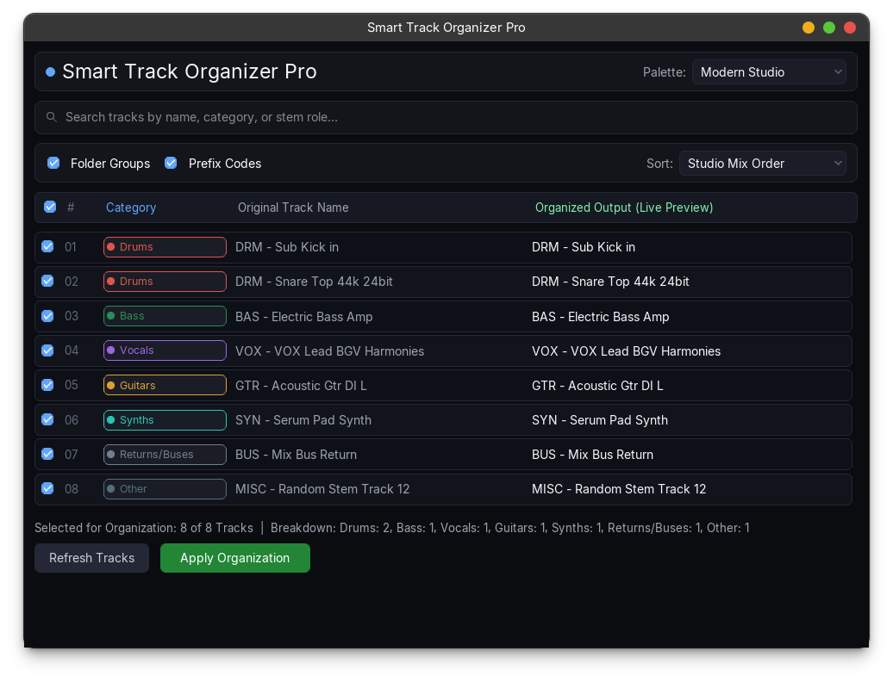

# Smart Track Organizer Pro

**Smart Track Organizer Pro** is a modern DAW session organization suite for Cockos REAPER. It automatically classifies, formats, color-codes, sorts, and groups tracks using an industry-standard production lexicon and an interactive pure-Lua studio dashboard.

Built with a clean 3-layer architecture, 100% self-contained pure Lua, bundled RTK (REAPER Toolkit), and zero external binary dependencies.




---

## Authors

- **Group 3**


---

## Key Features

- **Context-Aware Classification Engine**:
  - Over 150+ stems and shorthand terms recognized across 11 professional studio categories (Drums, Bass, Vocals, Guitars, Keys, Synths, Strings, Brass & Winds, FX, Mix Buses & Aux Returns, Reference).
- **FX-Chain Inspection Clues**:
  - Resolves ambiguous track names (such as `Audio 01`, `Track 05`) by inspecting loaded VST/AU instruments and plugins (e.g. Serum, Superior Drummer, Kontakt, Guitar Rig, Melodyne, Omnisphere).
- **5 Studio Color Palettes**:
  - *Modern Studio*: Vibrant, high-contrast dark theme.
  - *Pastel Soft*: Gentle, low-fatigue studio palette.
  - *Vintage Console*: Inspired by classic SSL and Neve desk channels.
  - *Cyber Neon*: Vivid, modern synthwave styling.
  - *Monochrome Slate*: Sleek, minimalist grayscale workflow.
- **Audio Engineering Technical Acronym Preservation**:
  - Cleans up messy stem names while strictly preserving critical engineering markers (`DI`, `FX`, `EQ`, `MIDI`, `BGV`, `DBL`, `NY`, `VCA`, `L`, `R`, `OH`, `SUB`, `RMS`).
- **Interactive Pure-Lua Studio Dashboard**:
  - Modern dark glass aesthetic with rounded corners, real-time live search, animated focus borders, and instant live preview rows.
- **Multi-Strategy Sorting**:
  - *Studio Mix Order*: Drums -> Bass -> Guitars -> Keys -> Synths -> Vocals -> FX -> Buses.
  - *Vocal-First Flow*: Vocals -> Drums -> Bass -> Instruments -> FX -> Buses.
  - *Alphabetical (A-Z)*: Clean alphabetical sorting by cleaned stem label.
  - *Original Project Order*: Preserves existing track arrangement while applying colors and formatting.
- **Folder Hierarchy Automation**:
  - Automatically generates parent folder tracks (`STO - Drums`, `STO - Vocals`, etc.) with correct REAPER folder depth calculations.
- **Selective Per-Track Toggle & Search**:
  - Individual track checkboxes, a master select-all toggle, and an instant search filter.
- **Atomic Undo Integration**:
  - Single-step undo (`Ctrl+Z` / `Cmd+Z`) safely restores your session without corrupting routing, sends, or existing folders.

---

## Architecture & Code Structure

The codebase is built following separation of concerns:

```
smart-track-organizer/
├── Smart Track Organizer.lua      # ReaScript main entry point and ReaPack metadata header
├── src/
│   ├── smart_track_organizer_core.lua # Pure business logic: classification, sorting, color plan
│   ├── lexicon.lua                # Production lexicon, category schemas, and acronym definitions
│   ├── palettes.lua               # 5 curated studio color themes and hex/RGB math
│   ├── reaper_adapter.lua         # REAPER API bridge, track collection, extstate, and undo blocks
│   ├── ui_state.lua               # Reactive UI state coordinator (selection, options, filters)
│   ├── ui_components.lua          # Modular UI component and layout builders
│   ├── ui_rtk.lua                 # Thin RTK GUI controller
│   ├── ui_draw_helpers.lua        # Modern vector drawing routines (cards, pill badges, dots)
│   ├── ui_native.lua              # Headless/fallback UI runner
│   ├── theme.lua                  # Central design tokens, color constants, and typography scales
│   └── lib/
│       └── rtk.lua                # Bundled self-contained REAPER Toolkit (pure Lua)
└── tests/
    ├── test_smart_track_organizer.lua # Core classification and sorting test suite
    ├── test_lexicon.lua               # Lexicon and acronym dictionary validation
    ├── test_palettes.lua              # Palette completeness and RGB conversion tests
    ├── test_reaper_adapter.lua        # REAPER API mock adapter and undo block tests
    ├── test_advanced_features.lua     # Multi-strategy sorting and FX context tests
    ├── test_strict_edge_cases.lua     # Folder depth math and edge-case stem names
    ├── test_ui_rtk.lua                # RTK component instantiation and NativeMenu tests
    └── test_ui_state.lua              # Isolated UI state store and filtering tests
```

---

## Installation & Usage

### Manual Installation in REAPER

1. Open REAPER.
2. Open the Action List: **Actions > Show action list...** (or press `?`).
3. Click **New action... > Load ReaScript...**.
4. Select `Smart Track Organizer.lua` from this repository.
5. Click **Run** (or bind it to a custom shortcut or toolbar button).

---

## Testing & Quality Assurance

The project includes an automated test suite containing 38 unit tests across 8 test suites.

To run the entire test suite locally:

```bash
./run_tests.sh
```

### What the Test Suite Validates:
- 150+ stem token classifications and boundary regexes.
- Contextual FX plugin heuristic classification.
- Audio acronym preservation and titlecasing algorithms.
- Zero-based REAPER folder insertion mathematics and non-nesting guarantees.
- Mocked REAPER API adapter transactions (undo blocks, extstate persistence, track mutations).
- Reactive UI state store transitions and search filtering.
- Lua 5.4, Lua 5.3, and LuaJIT cross-compatibility.


